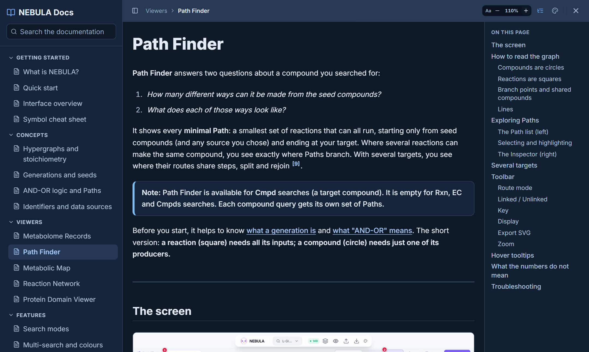

# Themes and accessibility

NEBULA is meant to be comfortable to read for long sessions. You can change the colour theme and the size of help text at any time.

---

## Text size

Look for the **Aa − +** control:

- in the **Help menu** (bottom-right button);
- at the top of the **documentation**;
- in every **tour card**, **Quick Help** card, **Key** pop-up and **viewer help** panel.

| Button | Does |
|---|---|
| **−** | Smaller text (down to 80%). |
| **+** | Larger text (up to 200%). |
| Percentage | Click to reset to 100%. |

The setting applies to **all** of those places at once and is remembered in your browser. Tables, symbol glyphs and images in the documentation grow with the text.

> **Note:** The text-size control covers help and documentation. Viewer canvases have their own size controls (for example **Font scale** and **Node size** in the Reaction Network settings, **Node & font size** in the Metabolic Map).

You can also use your browser's own zoom (<kbd>Ctrl</kbd> and <kbd>+</kbd>/<kbd>−</kbd>); the layout adapts.

---

## Themes

Click the **palette icon** (top bar, or the top of the documentation).

| Theme | Style |
|---|---|
| **Pulsar** | Light. Crisp cool-white surfaces with a violet-to-cyan accent. The default. |
| **Solar Corona** | Light. Warm parchment, sienna and olive; low glare, comfortable for long reading. |
| **Xenonite** | Light. Pale blue-white surfaces with a teal-blue accent. |
| **Magnetar** | Dark. Midnight cobalt with an ion-blue accent. |
| **Event Horizon** | Dark. Smoked charcoal with antique-gold accents. |
| **Astrophage** | Dark. Near-black surfaces with a molten-orange accent and a teal secondary. |

A theme changes everything: viewers, node colours, tour cards, Key pop-ups and this documentation. Query colours are picked from the theme's own palette. Your choice is remembered. If you have not chosen one, NEBULA starts in a dark theme when your system prefers dark mode.

---

## Making things easier to read

- **Increase the text size**, then use the **Key** button for symbols; glyphs scale with the text.
- **Switch theme** if a colour is hard to see; shapes and line styles (solid, dashed, dotted, hollow, filled) never depend on colour alone.
- For figures, choose **Publication** style in Path Finder: a colour-blind-safe palette.
- Every viewer can run in **fullscreen** (<kbd>F</kbd>).
- Most viewers can be used with the keyboard; see the shortcut tables on each viewer page.

---

## Keyboard shortcuts

| Where | Key | Action |
|---|---|---|
| Anywhere | <kbd>Ctrl</kbd>/<kbd>Cmd</kbd>+<kbd>K</kbd> | Open or close the search dock |
| Anywhere | <kbd>Esc</kbd> | Close the dock, a pop-up, the docs or a tour |
| Tour / Quick Help | <kbd>→</kbd> / <kbd>Enter</kbd>, <kbd>←</kbd> | Next / back |
| [Path Finder](view-path-finder) | <kbd>↑</kbd> / <kbd>↓</kbd>, <kbd>Esc</kbd> | Step through Paths, clear selection |
| [Reaction Network](view-reaction-network#keyboard-shortcuts) | <kbd>+</kbd> <kbd>-</kbd> <kbd>0</kbd> <kbd>Space</kbd> <kbd>←</kbd> <kbd>→</kbd> <kbd>R</kbd> <kbd>G</kbd> <kbd>F</kbd> <kbd>H</kbd> | See the page |
| [Metabolic Map](view-metabolic-map#mouse-and-keyboard) | <kbd>+</kbd> <kbd>-</kbd> <kbd>0</kbd> <kbd>R</kbd> <kbd>F</kbd> <kbd>H</kbd> | See the page |
