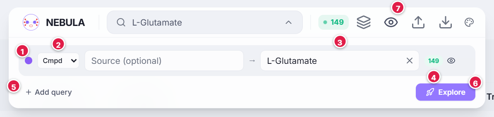

# Interface overview

A tour of every control that is always on screen. Viewer-specific controls are explained on each [viewer page](view-metabolome-records).

---

## The top bar (search dock)

1. **Colour dot.** The colour of this query in every viewer. Click it to choose another colour.
2. **Mode selector.** `Cmpd` (compound), `Rxn` (reaction), `EC` (enzyme class) or `Cmpds` (a set of compounds). See [Search modes](feature-search).
3. **Source → Target.** In `Cmpd` mode, **Target** is required and **Source** is optional.
4. **Result count and eye.** After a search, the green number is how many reactions the query returned. The eye shows or hides just that query.
5. **Add query.** Adds another row so you can compare searches.
6. **Explore.** Runs the search now. (If you only choose a target, NEBULA starts automatically after about one second.)
7. **Icon group.** Described below.

### Icons in the top bar

<nebula-key view="dock"></nebula-key>

Other top-bar behaviour:

- The **NEBULA logo** clears the current results and returns to the start screen (once you have results).
- <kbd>Ctrl</kbd>+<kbd>K</kbd> or <kbd>Cmd</kbd>+<kbd>K</kbd> opens or closes the dock; <kbd>Esc</kbd> closes it.
- The green badge with a pulsing dot is the number of reactions currently displayed.

---

## The view switcher (bottom centre)

| Tab | Viewer |
|---|---|
| **Metabolome Records** | [table of reactions](view-metabolome-records) |
| **Path Finder** | [minimal Paths to your target](view-path-finder) |
| **Metabolic Map** | [KEGG global map](view-metabolic-map) |
| **Reaction Network** | [hypergraph by generation](view-reaction-network) |
| **Split / Single** | [show two viewers side by side](feature-split-view) |

The switcher only appears once you have results.

---

## The Help button (bottom right)

- **Quick Help:** a short, step-by-step explanation of the viewer you are looking at, with the symbols drawn right in the card. (Only after a search.)
- **Documentation:** this guide, opened on the page for the current viewer.
- **Guided tour:** the full introduction to NEBULA.
- **Text size:** the **−** and **+** buttons change the size of text in the documentation, the tour, Quick Help, Key pop-ups and help overlays. Click the percentage to reset to 100%. NEBULA remembers your choice.

---

## Messages you may see

| Message | Meaning |
|---|---|
| **Tracing paths…** | A search is running. |
| **Search Error** (red card) | The query failed, usually because an ID was not found. |
| **Showing Path 3 → L-Glutamate · 7 reactions** (chip at the top) | You selected something in Path Finder while *Linked* is on, so the other viewers show only those reactions. Use **Open in Path Finder** to go back, or **×** to show everything again. See [Linked selection](feature-linked-selection). |
| Red **N deleted** badge | You deleted rows in Metabolome Records. Click it to restore them. |

---

## Themes

The palette icon in the top bar (and in the documentation) switches between six themes. Every viewer, key, tour card and documentation page follows the theme. See [Themes and accessibility](feature-themes-accessibility).
