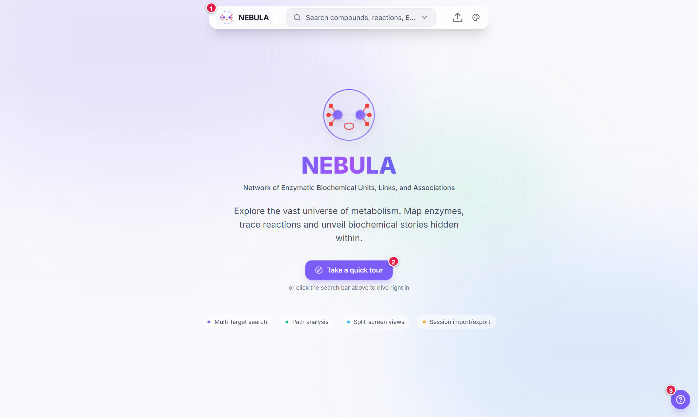

# What is NEBULA?

**NEBULA** stands for **N**etwork of **E**nzymatic **B**iochemical **U**nits, **L**inks, and **A**ssociations. It is a web server for exploring metabolism and the enzymes that run it, in one place and with one consistent picture.

Pick a compound, a reaction or an enzyme. NEBULA shows you every reaction involved, the routes that make a compound from simple starting materials, and, for each reaction, the enzymes, protein domains and 3D structures behind it [[1]](references#ref-1)[[2]](references#ref-2)[[4]](references#ref-4)[[5]](references#ref-5).

> **Preprint note:** NEBULA is described in a preprint that has not yet been peer reviewed. See [How to cite](references#how-to-cite).

---

## Why another metabolism viewer?

Pathway maps such as KEGG show *which* reactions are connected, but not how many molecules each reaction needs, which substrates must be present together, or which enzyme fold does the chemistry [[1]](references#ref-1). Stoichiometric models capture the chemistry but rarely connect to enzyme structure [[7]](references#ref-7)[[8]](references#ref-8).

NEBULA joins the two:

- **Every reaction is kept whole.** All substrates and all products stay together, with their stoichiometry, as one hyperedge ([Hypergraphs and stoichiometry](concept-hypergraph)).
- **Every compound has a generation.** Starting from a fixed set of seed compounds, the network is expanded step by step, and each compound is labelled with the step at which it first becomes reachable ([Generations](concept-generations)) [[9]](references#ref-9).
- **Every Path is complete.** A route to your target is only drawn if every reaction in it can actually run ([AND-OR logic and Paths](concept-and-or-paths)).
- **Every reaction leads to an enzyme.** From an EC number you can go to proteins, ECOD domains, active and binding sites, and the AlphaFold structure ([Protein Domain Viewer](view-protein-domains)).

### How NEBULA relates to other tools

- **Pathway databases and viewers** such as MetaCyc, Reactome, iPath, Escher and Pathway Tools organise reactions into curated, named maps and draw them well [[19]](references#ref-19)[[20]](references#ref-20)[[21]](references#ref-21)[[22]](references#ref-22)[[23]](references#ref-23). NEBULA keeps the familiar KEGG map as one viewer ([Metabolic Map](view-metabolic-map)) but rebuilds the data underneath as a stoichiometrically valid hypergraph.
- **Network expansion** work shows what a seed set can reach [[24]](references#ref-24)[[25]](references#ref-25), and MANET placed protein fold ages on KEGG maps [[26]](references#ref-26). NEBULA adds the *inverse* operation, tracing back from a compound through every minimal route, and links each reaction to domain-resolved enzymes.

---

## The four viewers

NEBULA shows one search in several **viewers**. They are different projections of the same data, and they stay in sync.

| Viewer | What it answers | Page |
|---|---|---|
| **Metabolome Records** | What exactly are the reactions, with their equations, generations and enzymes? | [Metabolome Records](view-metabolome-records) |
| **Path Finder** | How many different ways can this compound be made, and what does each look like? | [Path Finder](view-path-finder) |
| **Metabolic Map** | Where do these compounds sit on the familiar KEGG global map? | [Metabolic Map](view-metabolic-map) |
| **Reaction Network** | How do reactants, enzymes and products connect, generation by generation? | [Reaction Network](view-reaction-network) |

A fifth tool, the **Protein Domain Viewer**, opens from any EC number: see [Protein Domain Viewer](view-protein-domains).

---

## The screen at a glance

- **Top bar (search dock):** where you search, add queries, hide cofactors, import or export a session, and change theme.
- **Canvas:** the viewer you are in.
- **View switcher (bottom centre):** switch viewer, or split the screen in two.
- **Help button (bottom right):** documentation, Quick Help for the current viewer, the guided tour, and the **Text size** control.
- **Key button (inside each viewer):** a pop-up that explains every symbol the viewer draws.

1. The search dock. Click it or press <kbd>Ctrl</kbd>+<kbd>K</kbd> (<kbd>Cmd</kbd>+<kbd>K</kbd> on a Mac).
2. **Take a quick tour** starts the guided tour.
3. The Help button.

---

## Where to go next

- New here? Follow the [5-minute quick start](quick-start).
- Not sure what a shape or colour means? Open the [symbol cheat sheet](symbols-cheat-sheet) or press the **Key** button in any viewer.
- Want the science behind it? Start with [Generations](concept-generations).
- Need to cite NEBULA? See [References](references).
