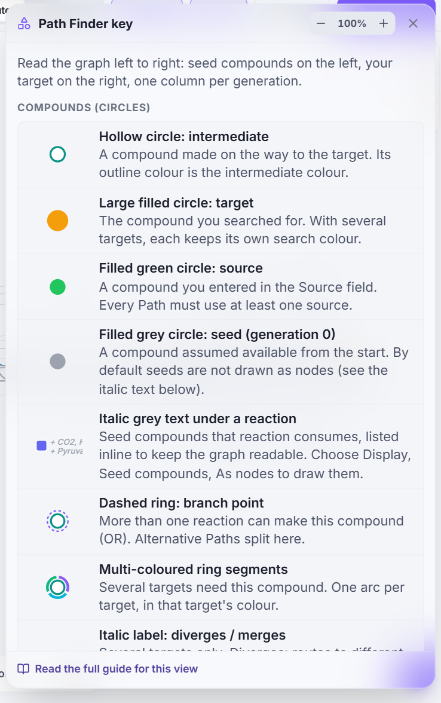

# Symbol cheat sheet

Every shape, line style and colour NEBULA draws, grouped by viewer. These are the same entries you see when you press the **Key** button inside a viewer, and they follow the active theme.

> **Tip:** Colours differ between themes (for example the highlight colour is green in Pulsar and teal in Astrophage), but shapes and line styles never change. If you export a figure, choose the *Publication* palette in Path Finder for colour-blind-safe colours.

---

## Quick comparison

The same ideas are drawn differently in each viewer. This table shows the equivalents.

| Idea | Path Finder | Reaction Network | Metabolic Map |
|---|---|---|---|
| A compound | circle | circle | dot |
| A reaction | small square (one per reaction) | two rounded rectangles (reactant complex and product complex) joined by a dashed line | an arrow between two compounds |
| An enzyme (EC) | listed in the Inspector | ellipse | not drawn (the Metabolic Map shows compounds and reactions only; use another viewer for enzymes) |
| Generation | column (`SEED`, `GEN 3` …) | band (`Seed`, `Gen 3` …) and colour | colour |
| Seed compound | grey; usually written in italics under the reaction | circle in the `Seed` band | dot (red end of the rainbow) |
| Several reactions make one compound | dashed ring on the compound | several reaction boxes feeding the same circle | several arrows (or one pill "N rxns" when pruned) |

---

## Path Finder

<nebula-key view="path-finder"></nebula-key>

---

## Reaction Network

<nebula-key view="reaction-network"></nebula-key>

---

## Metabolic Map

<nebula-key view="metabolic-map"></nebula-key>

---

## Metabolome Records

<nebula-key view="records"></nebula-key>

---

## Protein Domain Viewer

<nebula-key view="protein"></nebula-key>

---

## Top bar

<nebula-key view="dock"></nebula-key>
