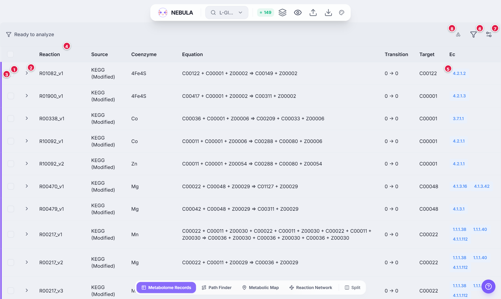

# Metabolome Records

**Metabolome Records** is the exact, row-by-row view of your search: one reaction per row, with the generation at which it first appears and its enzyme classification. Use it to inspect a reaction closely, to include or exclude reactions, and to jump from a reaction to the enzymes behind it [[1]](references#ref-1).

> **Tip:** If you want to see *how* reactions combine into routes, use [Path Finder](view-path-finder). If you want to see all reactions together as a network, use [Reaction Network](view-reaction-network).

---

## The screen

1. **Checkbox.** Select a row (the box in the header selects all).
2. **Chevron.** Expand the row for the KEGG definition and drawing.
3. **Coloured stripe and tint.** The colour of the search that produced the row.
4. **Column headers.**
5. **EC button.** Opens the [Protein Domain Viewer](view-protein-domains).
6. **Funnel.** Filter and Select.
7. **Gear.** Column visibility.
8. **Key button.** Symbol key for this view.

---

## Columns

| Column | What it shows |
|---|---|
| **Reaction** | The reaction ID. KEGG reactions look like `R00243`. A suffix such as `_v1` marks a variant that writes a cofactor or metal explicitly, and `RZ_…` is a NEBULA renaming reaction. See [Identifiers](concept-identifiers). |
| **Source** | `KEGG`, `KEGG (Modified)` or `Manual`. |
| **Coenzyme** | The cofactor or metal written explicitly in a variant (for example `Mg`). Empty for most rows. |
| **Equation** | All reactants `=>` all products, using compound IDs (KEGG `C` numbers, or `Z` cofactor roles). Expand the row for the KEGG definition. |
| **Transition** | `a -> b`: the generation at which the reactants are available, and the generation at which the product first appears. See [Generations](concept-generations). |
| **Target** | The compound the reaction was found for while tracing back to your search target. |
| **Ec** | The EC number(s) of the enzyme class. Each is a button. |

Rows are sorted by transition.

---

## Colours and Combined view

Each row has a coloured left stripe and a light tint in the colour of the **search chip** that produced it (see [Multi-search](feature-multi-search)).

With **Combined view** on (the stacked-layers icon in the top bar), each reaction appears once. A reaction found by several searches shows several small colour bars instead of one stripe.

<nebula-key view="records"></nebula-key>

---

## Looking closer at a row

### Expand
Click the **chevron** to see:

- **KEGG Definition:** the reaction in words, fetched from KEGG.
- **KEGG Reaction Diagram:** the chemical drawing from KEGG.

These come from the KEGG website, so they need an internet connection.

To look up what a compound ID means, use the compound search box in the top bar, [Path Finder](view-path-finder) (which shows names), the Selection panel in [Reaction Network](view-reaction-network), or **Compound names** in [Metabolic Map](view-metabolic-map).

---

## Choosing and removing reactions

1. **Tick** one or more rows. The toolbar shows how many are selected.
2. Choose:
   - **Keep Selection:** keep only the ticked rows and drop the rest.
   - **Delete Selection:** remove the ticked rows.
   - **Clear Selection:** untick everything.

Deleted reactions are not lost. A red **N deleted** badge appears in the toolbar; click it to see them and use **Restore all** or the restore arrow on a single reaction. While a reaction is deleted, [Path Finder](view-path-finder) draws it as a dashed red square with a struck-through ID and marks any Path that uses it as **broken**.

> **Note:** Selected rows are also highlighted in the other viewers, so you can pick reactions here and see where they sit in the network.

---

## Filter and Select

The **funnel** opens a small panel:

1. Choose **All Columns** or one column from the drop-down.
2. Type some text. Click the **`.*`** button inside the box to treat it as a regular expression (matching ignores upper and lower case).
3. Press **Search & Select** (or <kbd>Enter</kbd>). Every matching row becomes *selected*, so you can then Keep or Delete them. **Clear** empties the box and the selection.

Examples: `C00025` finds every reaction involving L-Glutamate; `^R00[0-9]+` finds reactions with IDs starting `R00`; `2\.6\.1\.` finds aminotransferases.

---

## Show or hide columns

The **gear** lists the seven columns (Reaction, Source, Coenzyme, Equation, Transition, Target, Ec). Untick the ones you do not need.

---

## From a reaction to a protein

Click an **EC button**. The [Protein Domain Viewer](view-protein-domains) opens for that enzyme class, listing proteins for that EC across organisms, their ECOD domains, annotated active and binding sites, and the AlphaFold structure [[2]](references#ref-2)[[4]](references#ref-4)[[5]](references#ref-5).

---

## Tips

- Pair Metabolome Records with another viewer in [Split view](feature-split-view).
- Use [Cofactor filtering](feature-cofactors) to hide cofactor-only differences between variants.
- A reaction can show up twice (forward and reverse). That is not a mistake: each direction is a separate row.
