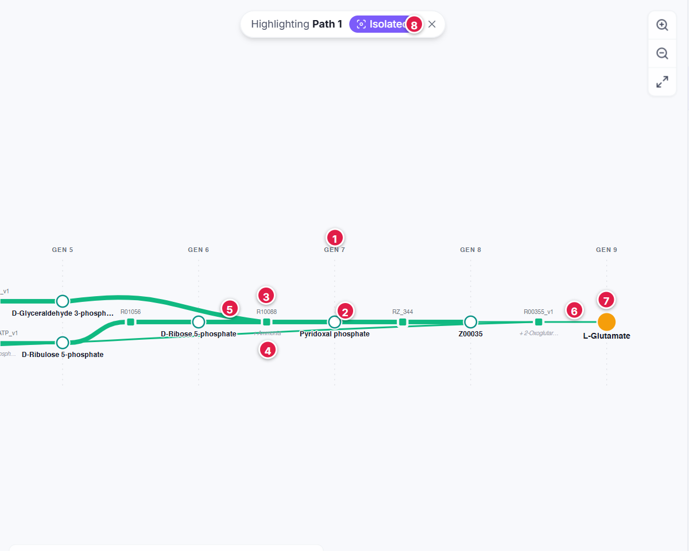
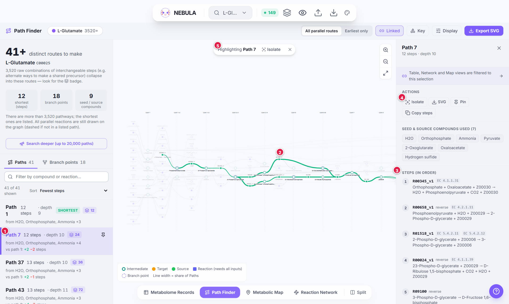
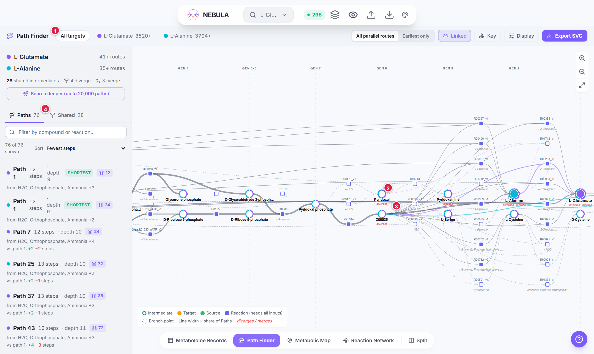
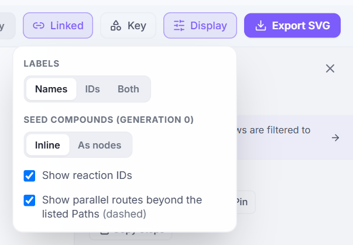

# Path Finder

**Path Finder** answers two questions about a compound you searched for:

1. *How many different ways can it be made from the seed compounds?*
2. *What does each of those ways look like?*

It shows every **minimal Path**: a smallest set of reactions that can all run, starting only from seed compounds (and any source you chose) and ending at your target. Where several reactions can make the same compound, you see exactly where Paths branch. With several targets, you see where their routes share steps, split and rejoin [[9]](references#ref-9).

> **Note:** Path Finder is available for **Cmpd** searches (a target compound). It is empty for Rxn, EC and Cmpds searches. Each compound query gets its own set of Paths.

Before you start, it helps to know [what a generation is](concept-generations) and [what "AND-OR" means](concept-and-or-paths). The short version: **a reaction (square) needs all its inputs; a compound (circle) needs just one of its producers.**

---

## The screen

. Numbered items are explained below.")

1. **Target chip.** One chip per target, with its raw Path count (a `+` means capped). The route mode switch **All parallel routes / Earliest only** is at the right of the toolbar.
2. **Toolbar buttons:** Linked, Key, Display, Export SVG.
3. **Summary.** Number of distinct routes, shortest Path, branch points, seed and source compounds.
4. **Path list.** One card per Path.
5. **Generation headers** (`SEED`, `GEN 3` …).
6. **The graph.** Left to right, seeds to target.
7. **Mini key** (bottom left).
8. **Zoom, zoom out and fit** buttons.

---

## How to read the graph

The graph runs **left to right**. Each column is a generation (`GEN 1`, `GEN 2` …), and a `SEED` column (generation 0) appears at the far left when you draw seeds as nodes. With the default *Inline* setting, seeds are written under the reactions that use them, so the first column is the earliest generation that has a compound. Compounds sit in the generation columns; reactions sit *between* the compounds they consume and the compounds they make. Lines have no arrowheads because direction is always left to right. A column header such as `GEN 4–5` means two generations share a column, which keeps every line pointing right.

1. **Generation header** (`GEN 7`). Everything below it sits in that generation.
2. **Hollow circle:** an intermediate compound (here pyridoxal phosphate, shown with its name).
3. **Square:** a reaction. Its ID (`R10088`) is printed above it.
4. **Italic grey text:** a seed compound (here ammonia) consumed by that reaction, written inline.
5. **Thick line:** this step is used by many of the listed Paths.
6. **Thin line:** this step is used by few of them.
7. **Large filled circle:** the target, L-Glutamate, in generation 9.
8. The **Isolated** pill: only the selected Path is drawn.

### Compounds are circles

| Symbol | Meaning |
|---|---|
|  | **Hollow circle: intermediate.** Made on the way to the target. |
|  | **Large filled circle: target.** The compound you searched for. In *All targets* each target keeps its search colour. |
|  | **Filled green circle: source.** A compound you typed in the **Source** field. |
|  | **Filled grey circle: seed (generation 0).** Only drawn when *Display > Seed compounds > As nodes* is chosen. |
|  | **Italic grey text under a reaction.** The seed compounds that reaction consumes. NEBULA writes them inline by default so seeds that feed many reactions do not clutter the graph. |

### Reactions are squares

| Symbol | Meaning |
|---|---|
|  | **Filled square.** A reaction used by at least one *listed* Path. It needs **all** its inputs. The reaction ID (`R#####`) is printed above it. |
|  | **Hollow square.** A valid *parallel* reaction that is on a route to the target but **not in any listed Path**. These appear when the Path list is capped (see [When the list is capped](concept-and-or-paths#when-the-list-is-capped)) and can be hidden. |
|  | **Dashed red square with a struck-through ID.** You deleted this reaction in [Metabolome Records](view-metabolome-records). |
|  | **Highlight-coloured square.** Part of what you are hovering over or have selected. (The highlight colour depends on the theme: green in Pulsar, amber in the Publication export style.) |

### Branch points and shared compounds

| Symbol | Meaning |
|---|---|
|  | **Dashed ring: branch point.** More than one reaction can make this compound, so alternative Paths split here. |
|  | **Multi-coloured ring segments.** Several targets need this compound; one arc per target. |
|  | **`diverges` / `merges`** (several targets only). *Diverges*: routes to different targets split here. *Merges*: different targets reach this compound by different reactions. |
|  | **Highlight-coloured outer ring.** The compound or reaction you clicked. |

### Lines

| Symbol | Meaning |
|---|---|
|  | **Width = share of listed Paths** that use this step. A thick line is on almost every Path; a thin line is on only a few. |
|  | **Dashed line.** Belongs to a hollow (unlisted) parallel reaction. |
|  | **Highlight-coloured line.** Part of the current highlight; the rest is dimmed. |
|  | **Pinned Paths.** Up to four Paths overlay in four colours, earlier pins thicker. |
|  | **Coloured line** (several targets). Used only by the target of that colour. |
|  | **Dark line** (several targets). Shared by more than one target. |

> **Tip:** Every one of these symbols is also in the **Key** button in the toolbar, and in the [symbol cheat sheet](symbols-cheat-sheet).

---

## Exploring Paths

### The Path list (left)

The top of the panel is a summary:

- the big number is **how many distinct routes** make your target (a `+` means the list was capped);
- **shortest (steps):** the fewest reactions in any Path;
- **branch points:** how many compounds have two or more producers;
- **seed / source compounds:** how many different seed or source compounds the listed Paths use.

Below it are two tabs:

- **Paths:** the list of Paths.
- **Branch points** (or **Shared** with several targets): a list of those compounds. Click one to see every Path that goes through it.

Above the list: a **filter box** (type a compound name or ID, a reaction ID or an EC number) and a **sort** menu (**Fewest steps**, **Shallowest**, **Fewest seed / source compounds**).

Each **Path card** shows:

| Part | Meaning |
|---|---|
| **Path 3** | Number of the Path in the original order. |
| **7 steps** | Number of reactions. |
| **depth 5** | The longest chain of reactions that must run in sequence. |
| **shortest** | This Path has the fewest reactions. |
| layers badge with a number | That many equivalent combinations are grouped into this one card. |
| **broken** (warning) | The Path uses a reaction you deleted in Metabolome Records. |
| pin icon | Pin this Path (up to four) to overlay it. |
| **from …** | The seed or source compounds the Path consumes. |
| **vs path 1: +2 −1 steps** | Compared with the shortest Path it adds 2 reactions and drops 1. |

### Selecting and highlighting

- **Hover** a card to preview the Path on the graph. **Click** it to highlight it (click again to clear).
- **Click any compound or reaction** in the graph to highlight *every* Path through it. The list filters to those Paths.
- <kbd>↑</kbd> / <kbd>↓</kbd> step through the list. <kbd>Esc</kbd> or a click on empty space clears the selection.
- **Pin** up to four Paths to compare them in different colours.
- **Isolate** (top pill on the graph, or in the Inspector) redraws *only* your selection. Click again to go back.

### The Inspector (right)

It appears when something is selected.

| You selected | The Inspector shows |
|---|---|
| **A Path** | Actions (Isolate, SVG, Pin, **Copy steps**), the seed and source compounds it uses, and the **steps in order**, each with its equation and EC numbers. Hover a step to find it on the graph; click to select it. |
| **A compound** | How many listed Paths use it (a bar and a percentage), which targets need it, any *diverges* / *merges* note, **Made by** (the alternative reactions that produce it, with each one's share) and **Used by**. |
| **A reaction** | The equation, EC numbers, its share of Paths and **Participants**: *Requires (all of)*, *Produces (on route)*, *Side products* and *Cofactors (assumed available)*. |

1. The selected Path card.
2. The highlighted Path (drawn in the theme's highlight colour) with everything else dimmed.
3. The Inspector listing the steps in order.
4. Isolate, SVG, Pin and Copy steps.
5. The "Highlighting …" pill, with Isolate and clear.

---

## Several targets

When you search several compounds, an **All targets** chip appears next to the individual targets.

- **All targets** overlays every target's route graph. Each target's own steps use its colour; steps used by more than one target are dark.
- **Shared** lists compounds needed by more than one target. Click one to see which targets use it and whether it **diverges** or **merges**.
- A single target chip shows just that target.

1. The **All targets** chip.
2. A shared compound with a multi-coloured ring.
3. A `diverges` label.
4. The **Shared** tab.

---

## Toolbar

### Route mode

| Button | Meaning |
|---|---|
| **All parallel routes** | Every route whose substrates are reached no later than their products. Includes same-generation (lateral) reactions. |
| **Earliest only** | Only strictly generation-increasing routes. |

See [AND-OR logic and Paths](concept-and-or-paths#route-modes). Changing mode re-runs the search.

### Linked / Unlinked

While **Linked** is on, whatever you select here **filters** the other viewers to exactly those reactions. A chip at the top of the other viewers tells you what they are showing. **Unlinked** turns this off. See [Linked selection](feature-linked-selection).

### Key

Opens the symbol key shown above.

### Display

| Setting | Options |
|---|---|
| **Labels** | **Names**, **IDs** or **Both** for compounds. |
| **Seed compounds (generation 0)** | **Inline** writes seeds under each reaction; **As nodes** draws them as grey circles. |
| **Show reaction IDs** | Prints the `R#####` above every square. |
| **Show parallel routes beyond the listed Paths (dashed)** | Appears only when some reactions are outside the listed Paths. Untick to hide hollow squares and dashed lines. |

### Export SVG

Creates a standalone vector figure.

| Choice | Options |
|---|---|
| **What to export** | **Whole pathway graph** (all listed Paths, no highlighting), **Current view** (as shown, with the selection and pinned Paths emphasised) or **Selection only** (just the selected Path, or the Paths through the selected compound, laid out again). |
| **Style** | **Publication** (a colour-blind-safe palette on white) or **Current theme**. |
| **Extras** | **Title & caption**, **Legend** and **Background** can each be switched off. |

The file is named like `nebula_Paths_C00025.svg`. Each generation is its own group, and compounds, reactions and edges are separate layers, so the figure is easy to edit in a vector editor.

### Zoom

Use the scroll wheel to zoom, drag to pan, the **+** and **−** buttons, and **Fit** to frame everything.

---

## Hover tooltips

- Hover a **compound** for its name and ID, generation, role, share of Paths, number of alternative producing reactions, and any diverge / merge note.
- Hover a **reaction** for its ID (with *reverse* if it runs in reverse), its equation in words, its EC numbers and its share of Paths.

---

## What the numbers do *not* mean

- A Path is **chemically complete**, not necessarily **biologically favourable**. NEBULA computes mechanistic reachability, not thermodynamics or kinetics, and it assumes all enzymes are available [[9]](references#ref-9)[[10]](references#ref-10).
- **Depth** (the longest chain of reactions in a Path) and **generation** (when the expansion first reaches a compound) are measured separately, so they can differ.
- A high **% of Paths** says the step is *common among the listed Paths*, not that it is the preferred one.

---

## Troubleshooting

| Symptom | Likely cause |
|---|---|
| "No pathway data" | The search was not a Cmpd search, or the target has no route from the seed set. A yellow card explains which. |
| Few or no Paths with *Earliest only* | Try **All parallel routes**. |
| The list ends in `+` | The enumeration cap was reached; use **Search deeper**. |
| A Path card says **broken** | It uses a reaction you deleted; restore it in Metabolome Records. |
