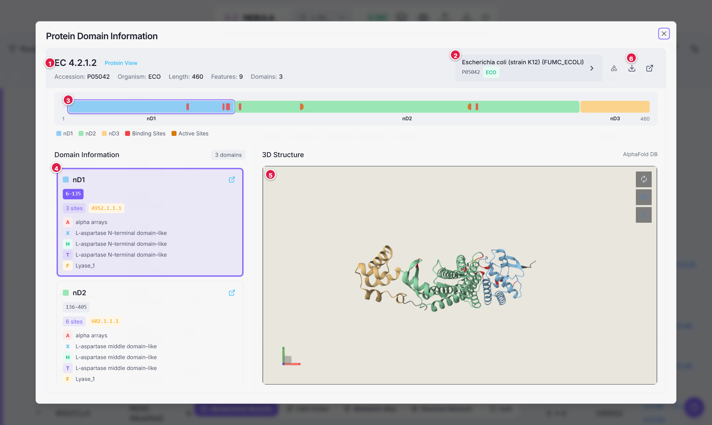

# Protein Domain Viewer

The **Protein Domain Viewer** takes you from a reaction to the *machinery that carries it out*: which proteins catalyse it, which independently folded **domains** they are built from, which residues are catalytic or bind a ligand, and what the protein looks like in 3D.

Together with the metabolic viewers, it gives you a single path from "this compound" to "this reaction" to "this enzyme" to "this fold". The manuscript uses it to study how a small set of ancient folds supports the metabolic core [[16]](references#ref-16)[[18]](references#ref-18).

---

## Opening it

- In [Metabolome Records](view-metabolome-records), click a blue **EC** button.
- In [Reaction Network](view-reaction-network), **right-click an EC ellipse** and choose **Protein Viewer**.

A large window opens, titled *Protein Domain Information*. Close it with the **×** or by pressing <kbd>Esc</kbd>.

---

## The screen

1. **Header.** The EC number and basic facts about the selected protein (**Accession**, **Organism**, **Length**, **Features**, **Domains**).
2. **Protein selector.** Choose among the proteins known for this EC number, listed by UniProt entry name, accession and organism code.
3. **Sequence bar.** The whole chain from residue 1 to the end, with domains, binding sites and active sites drawn on it.
4. **Domain cards.** One card per domain.
5. **3D structure.** The AlphaFold model, coloured to match the bar and cards.
6. **Buttons:** Key, **Export as SVG**, **Open in UniProt**.

---

## From a reaction to a protein: how the links work

The links between reaction, enzyme, protein and domain are **many-to-many** [[1]](references#ref-1)[[2]](references#ref-2):

- one reaction can have several EC numbers;
- one EC number can correspond to many genes in an organism, and to many organisms;
- one gene can encode a multifunctional enzyme with more than one EC number.

NEBULA follows these links: **EC number → UniProt accessions (per organism) → AlphaFold model → ECOD domains and residue ranges**. UniProt accessions are linked to AlphaFold Database models [[4]](references#ref-4), which gives a consistent structural reference even when many PDB entries exist for the same protein in different constructs and resolutions [[3]](references#ref-3).

When you open the viewer, the list of proteins appears straight away. The first protein loads immediately and the others load in the background; a counter such as `3/12` shows progress.

---

## The sequence bar

Residues are laid out left to right, from residue 1 to the length of the chain.

| Symbol | Meaning |
|---|---|
|  | **Coloured block: ECOD domain** [[5]](references#ref-5). Its position and width are its residue range. Each domain keeps its colour in the bar, in its card and in the 3D view. Click a block to select that domain. |
|  | **Red bar: binding site.** UniProt annotates these residues as binding a ligand: a substrate, product, cofactor, prosthetic group or metal ion [[2]](references#ref-2)[[15]](references#ref-15). |
|  | **Amber bar: active site (catalytic).** Residues that take part directly in catalysis, for example by transferring a proton, forming a transient covalent intermediate or stabilising a reaction intermediate. |

Hover a site for its type and residue numbers. The legend under the bar lists every domain and whether binding or active sites are present.

> **Note:** Binding sites are drawn on the bar a little taller than active sites. Where both overlap a domain, the amber active-site mark is on top.

---

## Domain cards

Each card describes one ECOD domain:

- **Domain name** (for example `nD1`), a colour square, and a link icon to the domain's page at ECOD.
- **Residue ranges.** If the domain is made of disconnected pieces of the chain, a chip appears for each (`6–70`, `131–230` …) and a **segments** badge tells you how many. Click a chip to focus that piece in 3D.
- **Sites tag** (for example *3 sites*): how many annotated binding or active sites fall inside the domain.
- **Family tag** (yellow-orange): the ECOD family number.
- **Hierarchy badges**, one per ECOD level.

### The ECOD hierarchy

ECOD classifies each independently folded region of a protein chain into a hierarchy that terminates in families [[5]](references#ref-5):

<nebula-key view="protein"></nebula-key>

Each badge is followed by the ECOD name at that level (for example *alpha arrays* at A, *L-aspartase N-terminal domain-like* at X, H and T, and *Lyase_1* at F). The amber family tag is the numeric ECOD family id; its first number is the **X-group**, which is how the manuscript refers to folds, for example the Rossmann-like X-group 2003 [[16]](references#ref-16).

### Why this matters

Because ECOD divides a protein *chain* into *domains*, NEBULA can tell you **which** domain carries out the catalysis, not just which protein. Comparing proteins for the same reaction then shows whether the same function is done by a conserved domain architecture, by different arrangements of related domains, or by structurally unrelated solutions.

---

## The 3D structure

The structure is the **AlphaFold** prediction for the selected UniProt accession [[4]](references#ref-4), shown with **Mol\*** [[14]](references#ref-14) as a cartoon.

- Each domain is coloured as in the sequence bar.
- **Binding-site residues are red** and **active-site residues are amber**, drawn over the domain colour.
- Residues outside any domain are grey.
- Click a **domain card**, a **range chip** or a **block** in the bar and the camera focuses on those residues.
- Use the mouse as in any Mol\* viewer: drag to rotate, scroll to zoom, right-drag to pan.

The background follows the NEBULA theme.

### If the structure does not load

| Message | Meaning |
|---|---|
| *Loading 3D structure… Fetching from AlphaFold DB* | Wait a moment. |
| *No AlphaFold structure available for accession …* | AlphaFold has no prediction for this entry. |
| *Failed to load structure* | A network problem, or the 3D library could not be loaded. Check your connection. |
| *Data Error* | No protein data is available for this EC number. |

---

## Exporting

- **Export as SVG** (download icon) saves a figure with the protein view, the sequence bar with domains and sites, and the domain information.
- **Open in UniProt** (link icon) opens the selected entry on the UniProt website.

---

## Limits

- AlphaFold models are uniform, but they lack the ligand and conformational information found in experimental structures [[4]](references#ref-4).
- Residue-level annotation in UniProt is uneven, so some proteins show few or no sites even though they have them in reality [[2]](references#ref-2).
- The protein lists come from a fixed EC-to-protein mapping shipped with NEBULA; protein records and structures are fetched live from UniProt and AlphaFold.

See [FAQ and limitations](reference-limitations-faq).
